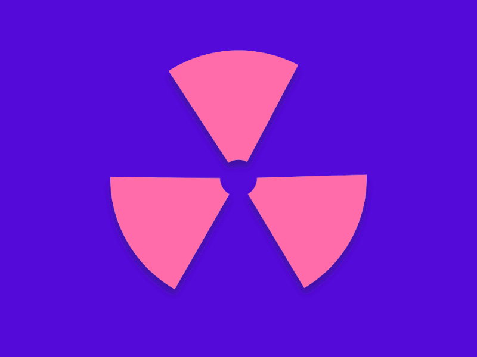

<h1> Hey, nice to see you.</h1>

  
Welcome to my page!   I'm Arijit Roy, Machine Learning  engineer from  <b>New Delhi, India</b>, currently studying Computer Science. I like building end to end machine learning/deep 
  learning applications. My field of interest is mainly computer vision and  MLOps.

<h3>Things I code with </h3>

<h4>AI</h4>

  

  

 
 
<h3>My Projects  </h3>
<table>
  <thead align="center">
    <tr border: none;>
      <td><b>🎁 Projects</b></td>
      <td><b>⭐ Stars</b></td>
      <td><b>📚 Forks</b></td>
      <td><b>🛎 Issues</b></td>
      <td><b>📬 Pull requests</b></td>
    </tr>
  </thead>
  <tbody>
    <tr>
	    <td><a href="https://github.com/radioactive11/ALPR-India"><b>ALPR India</b></a></td>
      <td></td>
      <td></td>
      <td></td>
      <td></td>
    </tr>
	  <tr>
		  <td><a href="https://github.com/radioactive11/HealthBridge"><b>HealthBridge</b></a></td>
      <td></td>
      <td></td>
      <td></td>
      <td></td>
    </tr>
		<tr>
			<td><a href="https://github.com/radioactive11/rezonance"><b>re<strong>Z</strong>onance</b></a></td>
      <td></td>
      <td></td>
      <td></td>
      <td></td>
    </tr>
  </tbody>
</table>

<h3>My latest projects </h3>
<ul>
  <li><a href="https://github.com/radioactive11/rezonance" width="20" alt="new">re<b>Z</b>onance</b></a> <i>A content based recommendation system which eliminates the cold start problem</i></li>

  <li><a href="https://github.com/radioactive11/Facial-Expression-Recognition"><b>Facial Expression Recognition (Kaggle Competition 2013)</b></a> <i>Detect human emotions from facial images</i></li>

  <li><a href="https://github.com/radioactive11/ML-Notebooks"><b>ML/EDA notebooks</b></a> <i>Notebooks containing Exploratory Data Analysis and Feature Engineering</i></li>

</ul>
