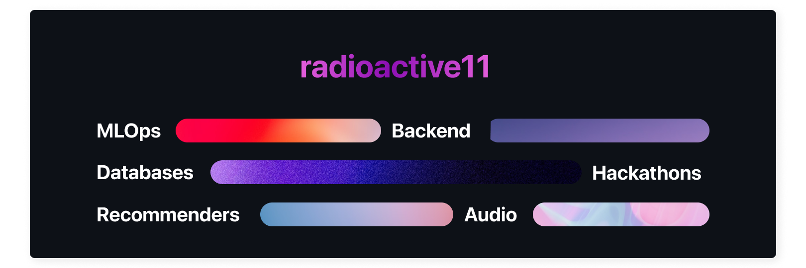

 
 

I am Arijit Roy, a backend and machine learning engineer from New Delhi, India. I develop products that are that are driven by data and innovation.

 

Here is a non-exhaustive list of things I do:
<li> Extracting meaningful insights from data
<li> Building recommendation engines
<li> Working on classification and clustering problems
<li> Work with computation/data engineering libraries like Pandas, Numpy, PyTorch, OpenCV, etc
<li> Utilize cloud technologies like Cognitive Services, Storage, AzureML, etc.
<li> Build webservers using tools like Django, FastAPI, Celery, Redis, Apache Airflow, etc.

 
 

<h2>⚙️ Technologies I Use</h2>

 
 

<table style="border: none">
    <tr style="border: none">
        <td style="border: none"> <b>Languages</b> </td>
        <td align="right">
            
            
            
            
        </td>
    </tr>
    <tr>
        <td> <b>Web Frameworks</b> </td>
        <td align="right">
            
            
            
        </td>
    </tr>
    <tr>
        <td> <b>Microservices</b> </td>
        <td align="right">
            
            
            
        </td>
    </tr>
    <tr>
        <td> <b>SQL Databases</b> </td>
        <td align="right">
            
            
            
        </td>
    </tr>
    <tr>
        <td> <b>NoSQL Databases</b> </td>
        <td align="right">
            
            
            
        </td>
    </tr>
    <tr>
        <td> <b>Data Engineering</b> </td>
        <td align="right">
            
            
            
            
        </td>
    </tr>
    <tr>
        <td> <b>Machine Learning</b> </td>
        <td align="right">
            
            
            
            
        </td>
    </tr>
    <tr>
        <td> <b>Cloud Platforms</b> </td>
        <td align="right">
            
            
            
            
            
        </td>
    </tr>
    <tr>
        <td> <b>Tools</b> </td>
        <td align="right">
            
            
            
        </td>
    </tr>
</table>

<h2>🏗️ My Top Open Source Projects</h2>

 

 

<h2>🏡 Environment</h2>

 

![applembp] ![vscode] ![iterm2] ![tmux]

<h2> Recently Listening To</h2>

 

<h2>👻 Contact Me</h2>

 
 
  
 
 <a href="https://linkedin.com/in/arijitroy11" target="_blank">
 

<!-- Logo Marocs -->

<!-- Languages -->
[python]: https://img.shields.io/badge/Python-informational?style=flat&logo=python&logoColor=white&color=000000&labelColor=000000"
[cpp]: https://img.shields.io/badge/C++-informational?style=flat&logo=c%2b%2b&logoColor=black&color=fff&labelColor=000000"
[c]: https://img.shields.io/badge/C-informational?style=flat&logo=c&logoColor=white&color=000&labelColor=000000"
[bash]: https://img.shields.io/badge/Bash-informational?style=flat&logo=gnu-bash&logoColor=black&color=fff&labelColor=000000"
[swift]: https://img.shields.io/badge/Swift-informational?style=flat&logo=swift&logoColor=white&color=000&labelColor=000000"

<!-- Web Frameworks -->
[fastapi]: https://img.shields.io/badge/FastAPI-informational?style=flat&logo=FastAPI&logoColor=white&color=000&labelColor=000000"
[flask]: https://img.shields.io/badge/Flask-informational?style=flat&logo=flask&logoColor=black&color=fff&labelColor=000000"
[django]: https://img.shields.io/badge/django-informational?style=flat&logo=django&logoColor=white&color=000&labelColor=000000"
[socketio]: https://img.shields.io/badge/Socket%2eIO-informational?style=flat&logo=socket%2eio&logoColor=black&color=fff&labelColor=000000"

<!-- Microservices -->
[celery]: https://img.shields.io/badge/Celery-informational?style=flat&logo=celery&logoColor=white&color=000&labelColor=000000"
[rabbitmq]: https://img.shields.io/badge/RabbitMQ-informational?style=flat&logo=rabbitmq&logoColor=black&color=fff&labelColor=000000"
[kafka]: https://img.shields.io/badge/Kafka-informational?style=flat&logo=apache-kafka&logoColor=white&color=000&labelColor=000000"

<!-- SQL Databases -->
[postgres]: https://img.shields.io/badge/PostgreSQL-informational?style=flat&logo=postgresql&logoColor=white&color=000&labelColor=000000"
[mysql]: https://img.shields.io/badge/MySQL-informational?style=flat&logo=mysql&logoColor=black&color=fff&labelColor=000000"
[sqlite]: https://img.shields.io/badge/SQLite-informational?style=flat&logo=sqlite&logoColor=white&color=000&labelColor=000000"

<!-- NoSQL Databases -->
[mongodb]: https://img.shields.io/badge/MongoDB-informational?style=flat&logo=mongodb&logoColor=white&color=000&labelColor=000000"
[redis]: https://img.shields.io/badge/Redis-informational?style=flat&logo=redis&logoColor=black&color=fff&labelColor=000000"
[elastic]:  https://img.shields.io/badge/Elasticsearch-informational?style=flat&logo=elasticsearch&logoColor=white&color=000&labelColor=000000"

<!-- Data Engineering -->
[pandas]: https://img.shields.io/badge/Pandas-informational?style=flat&logo=pandas&logoColor=white&color=000&labelColor=000000"
[numpy]: https://img.shields.io/badge/NumPy-informational?style=flat&logo=numpy&logoColor=black&color=fff&labelColor=000000"
[airflow]:  https://img.shields.io/badge/Apache%20Airflow-informational?style=flat&logo=apache-airflow&logoColor=white&color=000&labelColor=000000"
[scipy]: https://img.shields.io/badge/SciPy-informational?style=flat&logo=scipy&logoColor=black&color=fff&labelColor=000000"

<!-- ML -->
[sklearn]: https://img.shields.io/badge/SciKitLearn-informational?style=flat&logo=scikit-learn&logoColor=white&color=000&labelColor=000000"
[tf]: https://img.shields.io/badge/TensorFlow-informational?style=flat&logo=tensorflow&logoColor=black&color=fff&labelColor=000000"
[keras]: https://img.shields.io/badge/Keras-informational?style=flat&logo=keras&logoColor=white&color=000&labelColor=000000"
[pytorch]: https://img.shields.io/badge/PyTorch-informational?style=flat&logo=pytorch&logoColor=black&color=fff&labelColor=000000"

<!-- Cloud -->
[azure]: https://img.shields.io/badge/Azure-informational?style=flat&logo=microsoft-azure&logoColor=white&color=000&labelColor=000000"
[aws]: https://img.shields.io/badge/Google%20Cloud-informational?style=flat&logo=google-cloud&logoColor=black&color=fff&labelColor=000000"
[gcp]: https://img.shields.io/badge/Keras-informational?style=flat&logo=keras&logoColor=white&color=000&labelColor=000000"
[heroku]: https://img.shields.io/badge/Heroku-informational?style=flat&logo=heroku&logoColor=black&color=fff&labelColor=000000"
[vercel]: https://img.shields.io/badge/Vercel-informational?style=flat&logo=vercel&logoColor=white&color=000&labelColor=000000"

<!-- Tools -->
[docker]: https://img.shields.io/badge/Docker-informational?style=flat&logo=docker&logoColor=white&color=000&labelColor=000000"
[git]: https://img.shields.io/badge/git-informational?style=flat&logo=git&logoColor=black&color=fff&labelColor=000000"
[postman]: https://img.shields.io/badge/Postman-informational?style=flat&logo=postman&logoColor=white&color=000&labelColor=000000"

<!-- enviroment -->
[applembp]: https://img.shields.io/badge/MacBook%20Pro-informational?style=flat&logo=apple&logoColor=white&color=000&labelColor=000000"
[vscode]: https://img.shields.io/badge/VS%20Code-informational?style=flat&logo=visual-studio-code&logoColor=white&color=000&labelColor=000000"
[iterm2]: https://img.shields.io/badge/iTerm2-informational?style=flat&logo=iterm2&logoColor=white&color=000&labelColor=000000"
[tmux]: https://img.shields.io/badge/tmux-informational?style=flat&logo=tmux&logoColor=white&color=000&labelColor=000000"
[tmux]: https://img.shields.io/badge/tmux-informational?style=flat&logo=tmux&logoColor=white&color=000&labelColor=000000"
